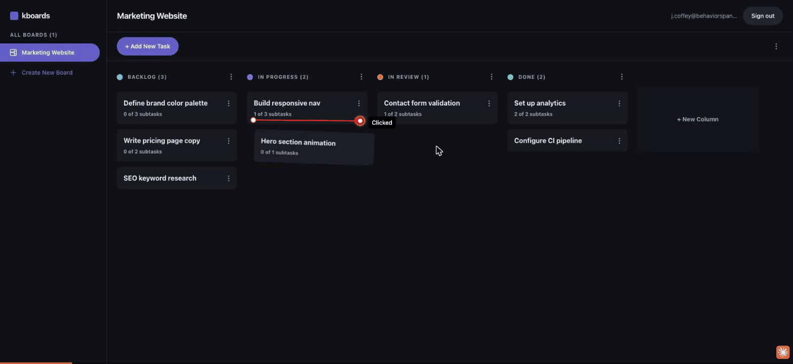

# kboards

**A Kanban board for tracking work** — boards, columns, tasks, and subtasks, with drag-and-drop,
optimistic updates, and a keyboard/screen-reader-accessible move path.

[](https://github.com/jeramiahgcoffey/kboards/actions/workflows/ci.yml)

- **Live:** [kboards.jeramiahcoffey.com](https://kboards.jeramiahcoffey.com)
- **Source:** [github.com/jeramiahgcoffey/kboards](https://github.com/jeramiahgcoffey/kboards)



kboards started in 2023 as a Vue 3 / Quasar 2 client plus a separate Express + TypeScript API. It is
being rebuilt in 2026 as a single **Next.js 16** full-stack app — the flagship "maintenance and
iteration" portfolio project. The rebuild is tracked visibly through commits, ADRs, PRs, and releases.

## Features

- **Boards, columns, tasks, subtasks** — full CRUD through nested REST Route Handlers behind an
  ownership-scoped service layer.
- **Drag-and-drop** — reorder tasks within a column and move them between columns (pointer), with
  optimistic updates and rollback on failure. Keyboard/screen-reader users get the same moves from
  each card's "Move up/down" and "Move to <column>" menu.
- **Accessible by design** — every task can also be moved from a keyboard/screen-reader "…" menu;
  stacked overlays share one Escape/focus registry; `prefers-reduced-motion` is respected.
- **Authentication** — email/password (Auth.js v5, Credentials + JWT sessions) with a custom
  password-reset flow whose tokens are stored only as SHA-256 hashes and are single-use.
- **Responsive** — a board-list sidebar that becomes a slide-over drawer on small screens.

## Tech stack

| Layer | Choice |
| --- | --- |
| Framework | Next.js 16 (App Router, Route Handlers, `proxy` middleware) |
| UI | React 19, Tailwind CSS v4, [dnd-kit](https://dndkit.com), [sonner](https://sonner.emilkowal.ski) |
| Language | TypeScript (strict) |
| Data | MongoDB via Mongoose 9 (embedded board document model) |
| Auth | Auth.js v5 (`next-auth`), Credentials provider, JWT sessions |
| Validation | zod |
| Email | nodemailer (SMTP; Resend in production) |
| Tests | Vitest + Testing Library + jsdom, axe-core |
| Hosting | Vercel + MongoDB Atlas |

## Architecture

A single Next.js app. Server Components fetch through a framework-free service layer and serialize
Mongoose documents into plain DTOs before crossing into Client Components. Route protection lives in
the Next.js 16 `proxy` (the renamed Middleware). Key decisions are recorded as ADRs:

- [ADR 0002 — Rebuild to a single Next.js app](docs/adr/0002-rebuild-to-single-nextjs-app.md)
- [ADR 0003 — Keep the embedded board document model](docs/adr/0003-keep-embedded-board-model.md)
- [ADR 0004 — Adopt Auth.js v5](docs/adr/0004-adopt-authjs.md)

```
app/            Routes: (auth) screens, /boards, and /api Route Handlers
components/     UI primitives (Modal, Menu, …) and board components
lib/            db (Mongoose models + connection), auth, services, DTOs, email
docs/adr/       Architecture Decision Records
```

## Getting started

**Prerequisites:** Node.js ≥ 22 and a MongoDB instance (local Docker is easiest).

```bash
# 1. Install
npm install

# 2. Configure environment
cp .env.example .env.local
#   then set AUTH_SECRET — generate one with:
openssl rand -base64 32

# 3. Start MongoDB (Docker example)
docker run -d --name kboards-mongo -p 27017:27017 mongo:7

# 4. Run the dev server
npm run dev            # http://localhost:3000
```

With `SMTP_HOST` left empty, password-reset links are logged to the server console instead of being
emailed — handy for local development.

## Scripts

| Command | Purpose |
| --- | --- |
| `npm run dev` | Start the dev server |
| `npm run build` / `npm start` | Production build / serve |
| `npm run lint` | ESLint |
| `npm run typecheck` | `tsc --noEmit` |
| `npm test` | Run the Vitest suite once |

## Testing

Vitest with two modes: Node for service/integration tests (which talk to a real MongoDB), and jsdom
for component tests (opted in per file with a `// @vitest-environment jsdom` docblock). Component
tests query by accessible role/label; `axe-core` smoke tests guard against a11y regressions.
Integration tests need a MongoDB at `MONGODB_URI` (defaults to `mongodb://localhost:27017/kboards-test`).
CI runs lint, typecheck, tests (against a MongoDB service container), and a production build on every
push and PR.

## Deployment

Deployed on **Vercel** (production branch: `main`) with **MongoDB Atlas** and **Resend** for email.
The Mongoose connection uses a global cache so it survives serverless invocations, and sessions are
JWT, so no session store is required. Set these environment variables in the Vercel project
(Production + Preview):

| Variable | Notes |
| --- | --- |
| `MONGODB_URI` | Atlas SRV string, with the `/kboards` database name |
| `AUTH_SECRET` | `openssl rand -base64 32` |
| `AUTH_URL` | The deployed origin, e.g. `https://kboards.vercel.app` |
| `EMAIL_FROM` | Sender for reset emails |
| `SMTP_HOST` / `SMTP_PORT` / `SMTP_USER` / `SMTP_PASS` | Resend: `smtp.resend.com` / `465` / `resend` / _API key_ |

## Author

Jeramiah Coffey — [GitHub](https://github.com/jeramiahgcoffey) ·
[LinkedIn](https://www.linkedin.com/in/jeramiah-coffey/)
