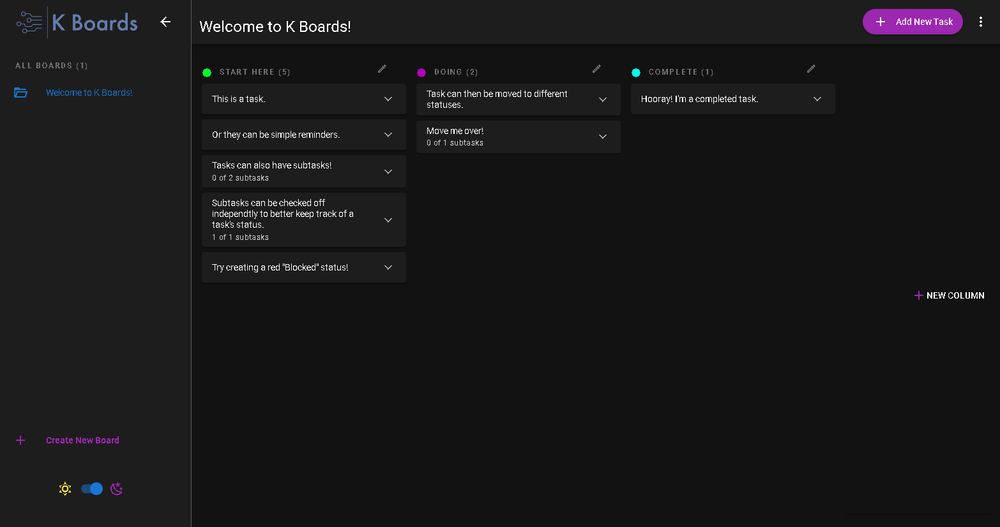

# K Boards
 **Productivity tracking app inspried by kanban boards.**
 
 K Boards can be used to track project completion for software applications or otherwise! 
 Featuring a responsive layout, drag-n-drop functionality, and password reset capability.
 
 *This application currently exists on a free cluster, please be patient on inital page load (1-2 minutes) when visting the site. I plan to upgrade the server soon.

## Table of contents

- [Overview](#overview)
  - [Screenshot](#screenshot)
  - [Links](#links)
- [My process](#my-process)
  - [Built with](#built-with)
  - [What I learned](#what-i-learned)
  - [Continued development](#continued-development)
  - [Useful resources](#useful-resources)
- [Author](#author)
- [Acknowledgments](#acknowledgments)

## Overview

### Screenshot

### Links

- Solution URL: [GitHub](https://github.com/jeramiahgcoffey/kboards)
- Live Site URL(Please be patient, it's a free server): [Render App](https://kboards.onrender.com/)

## My process

This application is inspired by Kanban, one of my preferred approaches to productivity tracking for software development, and tools such as the Jira platform. I have had a lot of fun developing this project so far, and I intend to continue iterating on it in order to exercise skills and implement new technologies.

### Built with

- Vue.js
- Quasar
- Pinia
- Vite
- Express.js
- MongoDB

### What I learned
This enitre app began as a learning project, to learn the Quasar framework. At one point, I was trying to flesh out the tool to potentially advocate for using it as a replacement frontend library. When it was decided my previous organization would not be changing their stack, I continued development on the appliction because I had a great devloper expereince using Vue3 and Quasar.
I learned a lot about the Quasar framework and it's built in features. I really enjoy the easy to implement toast notifications and theme customizations.
I also learned about Pinia, the new recommened state management solution for Vue3. Boy oh boy, it is so nice to work with. Goodbye mutations! Hello seemless reactivity and painless state management.

### Continued development
- In the future, I would love to extend the drag and drop functionality to include reordering task within their columns. I think this would make the application feel really nice to work with. I would also like to beef up the typescript usage, and testing coverage.
- Another feature that this application needs is user setting configurations. Currently, the vertical dot menu acts as a logout button. The next feature I would like to implement is adding a user menu, to allow for configuration changes, board management, sharing, and a logout button.
- I plan to add collaboration features to the app, allowing users to share boards between each other for viewing and editing.

### Useful resources

- Quasar Docs: [Here](https://quasar.dev/)
- Vue Docs: [Here](https://vuejs.org/)
- Pinia Docs: [Here](https://pinia.vuejs.org/)

## Author

- Website - [Jeramiah Coffey](https://github.com/jeramiahgcoffey)
- LinkedIn - [jeramiah-coffey](https://www.linkedin.com/in/jeramiah-coffey/)
